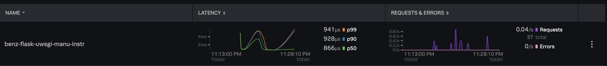

`uwsgi --http-socket 0.0.0.0:9000 --wsgi-file main.py --callable app --master --strict --die-on-term --vacuum --need-app --harakiri 30 --no-orphans --processes 6 --threads 2 --lazy-apps --cpu-affinity 1 --buffer-size 30000`

Instead of the above

Use the below

`uwsgi --http 127.0.0.1:5000 --wsgi-file main.py --callable app --master --processes 4 --enable-threads`

# Jek Observation
The main.py sent over didn't have a working route. It is essential to have a working route for testing.

# My setup

- Python v3.10.0
- Pip v21.2.3

# 20 Steps
1. Make sure it is python 3.6 or higher `python --version`

2. Create virtual environment `python -m venv venv`

3. Activate the virtual environment `source venv/bin/activate`

4. Install `pip install 'splunk-opentelemetry[all]'` 

5. Install `splunk-py-trace-bootstrap`

6. `export OTEL_SERVICE_NAME=benz-flask-uwsgi-manu-instr`

7. `export OTEL_TRACES_EXPORTER="jaeger-thrift-splunk"`

8. `export OTEL_EXPORTER_JAEGER_ENDPOINT=https://ingest.<realm from splunk o11y>.signalfx.com/v2/trace`

9. `export SPLUNK_ACCESS_TOKEN=<ingest token from splunk o11y cloud>`

10. Set environment name `export OTEL_RESOURCE_ATTRIBUTES=deployment.environment=jek-dev`
   

11. Set service version `export OTEL_RESOURCE_ATTRIBUTES=service.version=99.99.99`

12. View the packages before installing more `pip freeze`

13. Add `pip install opentelemetry-instrumentation-flask`

14. Add `pip install flask`

15. Add `pip install wheel`

16. Add `pip install uwsgi`

17. Add `pip install flask-restful`

18. Run the flask app with uwsgi using `uwsgi --http 127.0.0.1:5000 --wsgi-file app.py --callable app --master --processes 4 --enable-threads`

19. Invoke request via http://127.0.0.1:5000/

20. Deactivate the virtual environment `deactivate`

# Misc

Proof: 
